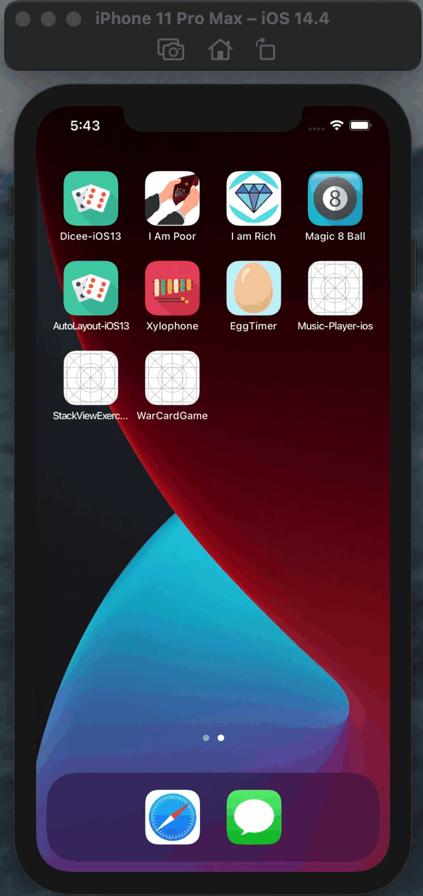

<h2>☑️ What is this app about?</h2>

Nice Card app where we can hit the deal button to be the changed the card faces randomly and gives away score.

<h2>☑️ What have I learned?</h2>
<ul>
  <li>Designing the UI.</li>
  <li>Changing UI elements programmatically.</li>
  <li>Detecting user interection and respond to it.</li>
  <li>Learned to use Swift Variables and Arrays to store data.</li>
  <li>Learned about randomisation in Swift.</li>
  <li>Sizing classes and orientation</li>
  <li>Understanding Constraints.</li>
  <li>Learned about Alignment and Pinning</li>
  <li>Using Containers for more fine grained control.</li>
  <li>StackViews.</li>
</ul>
<h2>☑️ Check out similar project that I did for Dice app</h2>
<h3><a href="https://github.com/NigoraFayzullaeva/dice-ios-app">Check out</a></h3>
<h2>☑️ Final look of War Card app🃏</h2>

